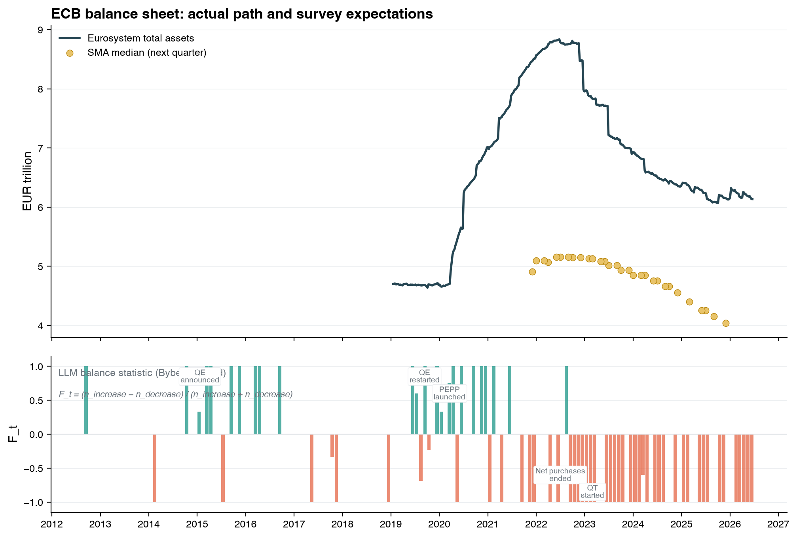
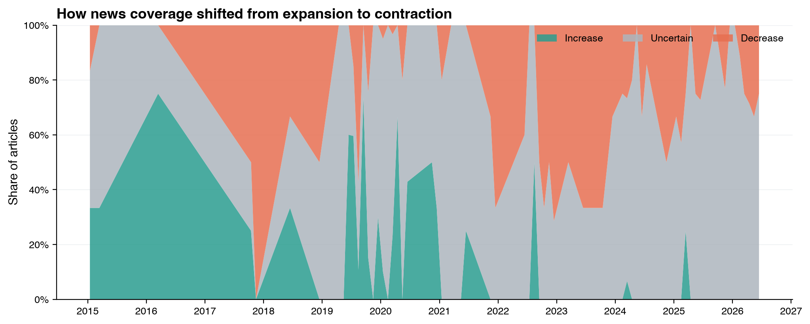
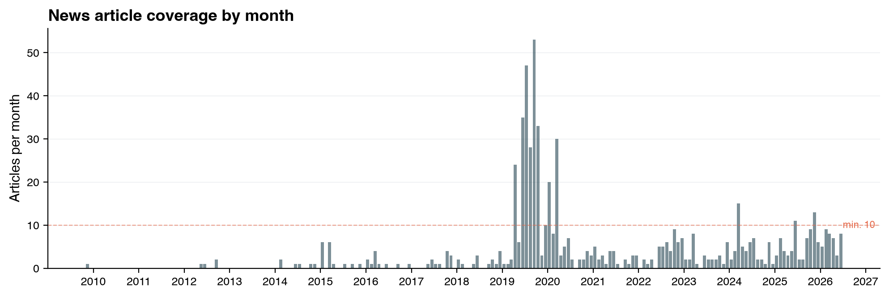
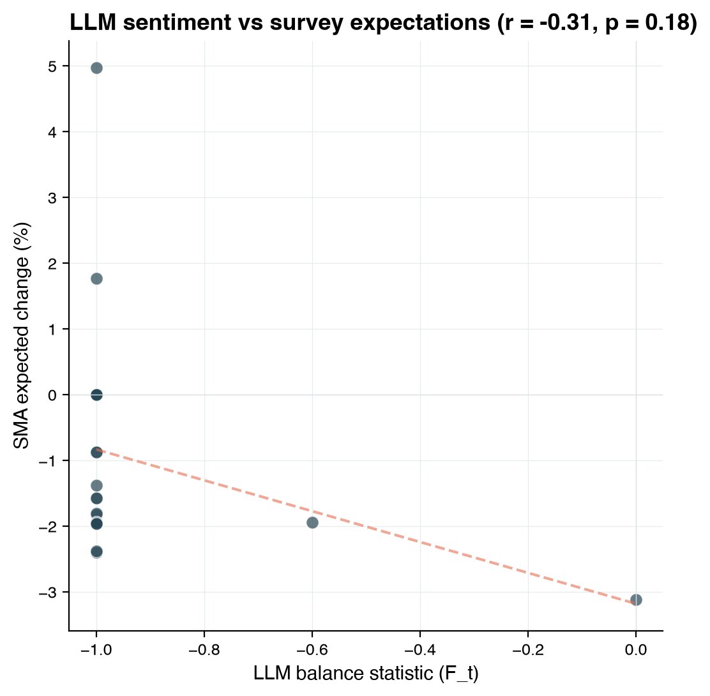
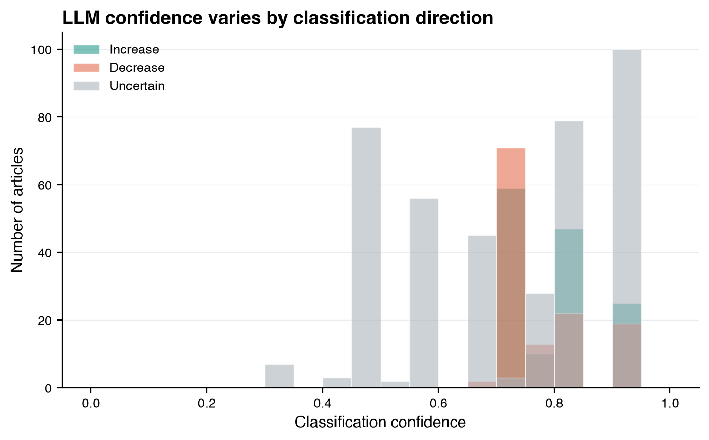
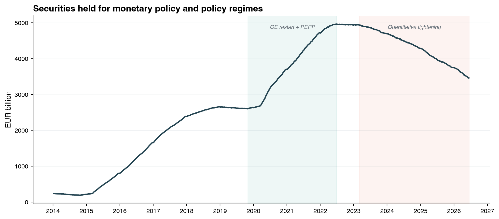

# ECB Balance Sheet Expectations: Survey vs LLM-Generated Beliefs

This project compares two sources of expectations about the ECB's balance sheet (Eurosystem bond holdings under APP and PEPP):

1. **Survey-based**: ECB [Survey of Monetary Analysts](https://www.ecb.europa.eu/stats/ecb_surveys/sma/html/all-releases.en.html) (SMA), a survey of ~70 professional forecasters conducted ~8 times per year, with machine-readable results published from June 2021
2. **LLM-generated**: Expectations extracted from news headlines using the methodology of [Bybee (2025), "The Ghost in the Machine"](https://lelandbybee.com/files/LLM.pdf), where an LLM classifies each headline as implying the balance sheet will *increase*, *decrease*, or is *uncertain*

The LLM classifications are aggregated into a monthly **balance statistic**:

$$F_t = \frac{n_{\text{increase}} - n_{\text{decrease}}}{n_{\text{increase}} + n_{\text{decrease}}}$$

which ranges from −1 (all articles signal contraction) to +1 (all articles signal expansion).

## Findings

### 1. Contamination is the main result

A v2 classifier with a relevance gate (few-shot anchors, `not_relevant` label, k=5 ensemble voting) flags **~90% of the headline corpus as off-topic** — articles about ECB interest rate decisions, other central banks, corporate earnings, and unrelated EU politics that were force-classified by v1 as increase/decrease/uncertain on the ECB *balance sheet*. Ensemble agreement on these labels is 98.8%.

The v1 F_t that appears to "track regimes" is substantially an artifact: article *volume* correlates with regime periods (more headlines during the QT announcement wave), and the directional signal is diluted by thousands of irrelevant classifications. Without a relevance gate, naive Bybee-style classification on a narrow topic produces a noisy index dominated by off-topic contamination. See [`docs/methods_note.md`](docs/methods_note.md) for a standalone write-up of this finding.

Hand-labelled accuracy comparison (v1 vs v2) is pending.

### 2. Dispersion channel: null

LLM headline dispersion (cross-sectional std of signed classifications per month) does not track SMA cross-forecaster disagreement (IQR at 1yr-ahead horizon): Pearson r = −0.04, p = 0.84, N = 30. Headlines carry first-moment (directional) signal, not belief heterogeneity. See `dispersion_analysis.py`, figures 7–8.

### 3. Lead-lag: suggestive but not robust

The expected ~1yr-ahead pace of balance-sheet change (from the SMA multi-horizon structure) runs from +12% (Dec 2021, still expecting expansion) to −12% (Dec 2025, deep QT). The primary test is whether changes in F_t predict revisions in this pace.

In first differences (trend-robust), lagged dF_t at lag +1 shows ρ = +0.317, p = 0.056 (N = 37). The sign is economically correct and stable across all F_t construction variants (confidence-weighted, magnitude-scaled, uncertain excluded). However:

- **HAC/Newey-West regression**: t = 0.38, p = 0.71. The multi-horizon pace is autocorrelated; naive Spearman overstates significance.
- **Drop-one jackknife**: 27 of 37 observations can flip significance past p = 0.05. No single outlier drives the result — there simply isn't enough signal.
- **Level correlogram**: all apparent significance vanishes after differencing — it was a shared downward trend (both F_t and pace track the QT regime), not news leading the survey.

Cannot distinguish "news leads the survey" from "both reacted to the same events with slightly different timing." See `leadlag_analysis.py` and `robustness_leadlag.py`, figures 9–11.

## Limitations

- **Single regime.** The SMA is public from June 2021 (40 vintages through June 2026), spanning only the QT regime. The Apr 2019–May 2021 pilot (which would cover the QE-expansion regime) was never released publicly; a direct data request to the ECB is outstanding.
- **~290 genuinely relevant articles over 12 years.** Google News RSS keyword search returns mostly off-topic results. Many months have 0–2 relevant headlines. The Bybee method was designed for large corpora (WSJ archive, thousands of articles/month); this application lacks that density.
- **N capped by survey frequency.** The SMA runs ~8 times/year. With 40 rounds and one structural break (the QT onset), there is not enough variation to establish a causal lead-lag relationship.
- **No article body text.** Only headline titles are available; no snippets or full text. Classification relies entirely on the headline.

## Figures

### Figure 1: Main comparison
Eurosystem securities held for monetary policy with SMA survey medians for APP+PEPP (top) and LLM balance statistic with key policy events annotated (bottom). The apparent regime tracking in F_t should be interpreted with the contamination caveat above.



### Figure 2: Classification shares over time
Share of articles classified as increase, uncertain, or decrease. Note that ~90% of these headlines are off-topic and force-classified by v1.



### Figure 3: Article coverage
Monthly article counts from Google News RSS and GDELT.



### Figure 4: LLM sentiment vs survey expectations
Scatter of F_t against SMA expected percentage change. Both Pearson and Spearman correlations are shown; neither is robust (see findings above).



### Figure 5: Confidence distribution
Distribution of the LLM's self-reported confidence scores by classification direction. Self-reported confidence is poorly calibrated (see methods note).



### Figure 6: ECB policy balance sheet with regime shading
Securities held for monetary policy with QE/QT regime periods shaded.



### Figures 7–8: Dispersion analysis (null result)
LLM headline dispersion vs SMA forecaster IQR — no relationship.

### Figures 9–11: Lead-lag and robustness
Differenced cross-correlogram, time series overlay, and robustness scatter with jackknife results.

## Data Sources

| Source | Coverage | Method |
|--------|----------|--------|
| ECB SMA CSV files | Jun 2021 – Jun 2026 (40 vintages) | Direct download via `collect_sma_v2.py` |
| Google News RSS | 2009–2026 | RSS feed search, 19 query variants, semi-annual historical windows |
| GDELT DOC 2.0 API | Apr 2019 – Apr 2020 | Keyword search (legacy, mostly superseded by Google News) |
| ECB APP/PEPP CSVs | Oct 2014 – present | Monthly holdings from ECB published breakdowns |
| ECB Data Portal (ILM) | 2014 – present | Weekly Eurosystem securities (asset 7.1) and lending (asset 5) |

## Pipeline

```
schema.py              Create DuckDB tables
collect_sma_v2.py      Download SMA survey data (40 vintages, all naming conventions)
collect_gnews.py       Fetch articles from Google News RSS
collect_ecb_bs.py      Download APP+PEPP holdings and policy balance sheet
process_headlines.py   V1 classifier (single Haiku call, no relevance gate)
classify_v2.py         V2 classifier (relevance gate, few-shot, k=5 ensemble)
aggregate.py           Compute monthly F_t from v1 classifications
compare.py             Correlation analysis (F_t vs SMA)
visualize.py           Generate figures 1–6
dispersion_analysis.py Dispersion analysis (figures 7–8)
leadlag_analysis.py    Lead-lag correlograms (figures 9–10)
robustness_leadlag.py  Jackknife, HAC, construction sensitivity (figure 11)
run_pipeline.py        CLI orchestrator
```

## Database

DuckDB file (`ecb_bs.duckdb`) with tables:
- `sma_raw` / `sma_expectations` — Survey data (40 vintages, MEDIAN/P25/P75)
- `gdelt_articles` — 2,895 news headlines (title only, no body text)
- `llm_classifications` — V1 classifications (no relevance gate, ~90% off-topic)
- `llm_classifications_v2` — V2 classifications (relevance-gated, ensemble; validation sample only)
- `llm_expectations` — Monthly aggregated F_t from v1
- `ecb_app_pepp` — APP+PEPP bond holdings (monthly)
- `ecb_policy_bs` — Securities + lending (weekly)

## References

- Bybee, L. (2025). [The Ghost in the Machine: Generating Beliefs with Large Language Models](https://lelandbybee.com/files/LLM.pdf). *Working Paper*.
- ECB Survey of Monetary Analysts: [All releases](https://www.ecb.europa.eu/stats/ecb_surveys/sma/html/all-releases.en.html)
- Healy, K. (2018). *Data Visualization: A Practical Introduction*. Princeton University Press.
