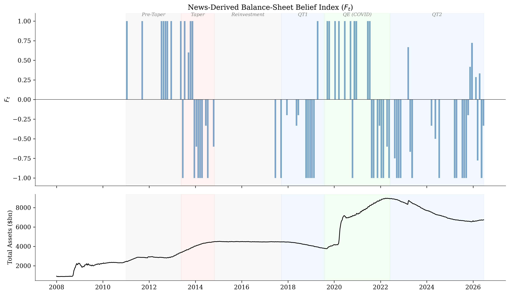
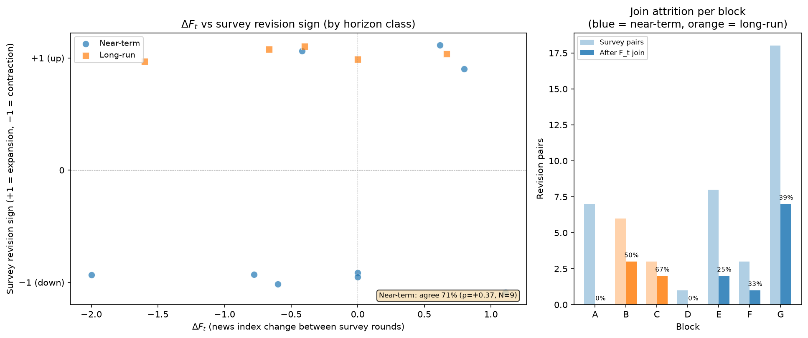

# Fed Balance Sheet Expectations

An LLM-derived news belief index ($F_t$, following Bybee 2025) for Federal Reserve balance-sheet expectations, compared with NY Fed professional-forecaster survey expectations (SPD/SMP/SME). The survey-side test object is the **sign of round-to-round revisions** in median balance-sheet expectations at a fixed horizon within each survey block. A **horizon-class split** separates near-term (pace/next-period) from long-run (terminal settle-point) beliefs, which are tested independently.

## Methodology: revision-direction survey object

The NY Fed surveys ask about the Fed balance sheet intermittently, and the question format (variable, unit, horizon grid) changes across eras. No single survey variable spans the full 2011--2026 period. Instead of splicing incompatible measures, this design keeps each contiguous block's native variable and extracts the **sign** of the round-to-round change in the median (pctl50) at a fixed absolute horizon:

- **+1** (toward expansion): forecasters revised the balance sheet upward (larger SOMA / more purchases / higher reserves)
- **-1** (toward contraction): forecasters revised downward
- **0**: no change (exact tie)

Signs are comparable across blocks even when the underlying units ($ billions, $ billions/month, level vs. change path) are not. The object is differenced by construction, removing trend and regime confounds that affect level comparisons.

### The 7 survey blocks

| Block | Variable | Range | Regime | Pairs |
|-------|----------|-------|--------|-------|
| A | SOMA size (total) | 2011-03 to 2012-07 | Pre-taper / QE2-OT | 7 |
| B | SOMA change path (Tsy) | 2013-04 to 2014-10 | QE3 / taper tantrum | 6 |
| C | Reserves path | 2017-06 to 2019-06 | QT1 / reinvestment end | 3 |
| D | SOMA size (total) | 2019-01 to 2019-03 | End-QT1 / COVID QE | 1 |
| E | Purchase pace (Tsy) | 2021-01 to 2022-01 | COVID QE / taper | 8 |
| F | SOMA change path (Tsy) | 2022-03 to 2022-07 | QT2 onset | 3 |
| G | Total assets (level) | 2024-01 to 2026-04 | QT2 / current | 18 |
| | | **Total** | | **46** |

Within each block, a single horizon date is selected by maximising the number of informative (non-zero) revision pairs, with ties broken toward nearer horizons.

## Horizon-class split

The survey asks conceptually different questions depending on how far the selected horizon extends beyond the block's survey window:

- **Near-term** (horizon offset $\leq$ 1.5 years): pace, next-period level, or near-horizon expectations. These revise on the same timescale as a high-frequency news index and are the appropriate test object for $F_t$.
- **Long-run** (horizon offset > 1.5 years): terminal or settle-point beliefs at multi-year horizons. A different, slower-moving belief object that a daily news index should not be expected to track the same way.

| Block | Selected horizon | Offset from last round | Class |
|-------|-----------------|----------------------|-------|
| A | 2012-12-31 | +0.4 yr | Near-term |
| B | 2017-06-30 | +2.7 yr | Long-run |
| C | 2025-06-30 | +6.1 yr | Long-run |
| D | 2019-12-31 | +0.8 yr | Near-term |
| E | 2022-05-15 | +0.3 yr | Near-term |
| F | 2023-11-15 | +1.3 yr | Near-term |
| G | 2026-11-15 | +0.6 yr | Near-term |

**Near-term**: blocks A, D, E, F, G (5 blocks, 37 revision pairs).
**Long-run**: blocks B, C (2 blocks, 9 revision pairs).

Pooling the two classes is reported for completeness but is not the headline, since it mixes distinct belief objects.

## News index ($F_t$)

### Corpus (2011--2026)

| Source | Articles |
|--------|----------|
| NYT Article Search API | 1,022 |
| GDELT DOC 2.0 | 2,491 |
| Google News RSS | 1,236 |
| **Total** | **4,749** |

Each headline (with article snippet when available) is classified into four categories using a k=3 ensemble of Claude Haiku calls with majority vote:

- **increase**: signals Fed balance-sheet growth (QE, emergency lending, slower runoff)
- **decrease**: signals balance-sheet contraction (QT, runoff, tapering)
- **uncertain**: balance-sheet-related but directionally ambiguous
- **not_relevant**: not about balance-sheet size or purchase/runoff policy

749 of 4,749 articles (15.8%) are classified as relevant.

### Balance statistic

$$F_t = \frac{n_{\text{increase}} - n_{\text{decrease}}}{n_{\text{increase}} + n_{\text{decrease}}}$$

Computed monthly over relevant articles. Ranges from $-1$ (all decrease) to $+1$ (all increase). Months with no increase or decrease articles are null.

## Results

### Regime identification

$F_t$ distinguishes Fed balance-sheet regimes by sign. Mean $F_t$ is positive during expansion periods and negative during contraction:

| Regime | Months ($n_{\text{rel}} \geq 3$) | Mean $F_t$ |
|--------|----------------------------------|-------------|
| Pre-Taper | 3 | +1.00 |
| Taper Tantrum | 12 | $-0.33$ |
| Reinvestment | 2 | $-1.00$ |
| QT1 | 7 | $-0.39$ |
| QE (COVID) | 17 | +0.06 |
| QT2 | 21 | $-0.39$ |

#### Figure: belief index with regime shading



$F_t$ over time across six Fed regimes. 749 relevant articles out of 4,749 total (15.8%).

### Revision-direction test: near-term (primary)

The near-term class (blocks A, D, E, F, G) is the primary test object. Of 37 survey revision pairs, 10 survive the inner join with $F_t$ (requiring $n_{\text{relevant}} \geq 3$ in both the current and prior survey months). After excluding 1 exact zero, 9 observations are used. The predictor is $\Delta F_t$ (the change in $F_t$ between consecutive survey rounds).

| Test | Statistic | Value | p-value | N |
|------|-----------|-------|---------|---|
| Spearman ($\Delta F_t$ vs revision sign) | $\rho$ | +0.37 | 0.332 | 9 |
| Sign agreement ($\Delta F_t$ and revision same direction) | rate | 5/7 = 71% | 0.453 (binomial) | 7 |
| OLS (quarter-clustered SEs) | $\beta$ | +0.39 | 0.316 | 9 |

All point estimates are in the expected direction (positive $\rho$, agreement rate above 50%, positive $\beta$). The test is underpowered at N = 9.

**Supporting color (regime-confounded):** the Spearman correlation of the $F_t$ *level* (not differenced) with near-term revision sign is $\rho$ = +0.65 (p = 0.058, N = 9). This is the strongest signal but reflects shared regime structure (both $F_t$ levels and revision directions flip sign across QE/QT eras) and is not interpretable as within-regime co-movement.

#### Figure: $\Delta F_t$ vs survey revision sign (by horizon class)



Left: scatter of $\Delta F_t$ vs revision sign, colored by horizon class (blue = near-term, orange = long-run), with per-class agreement rates annotated. Right: per-block attrition from the $F_t$ inner join.

### Long-run observation

The long-run class (blocks B, C) yields 5 observations after the $F_t$ join. All 5 surviving terminal/settle-point revisions are upward (+1): forecasters only ever revised terminal balance-sheet expectations upward over this sample (2013--2019). With constant revision sign, rank correlation is undefined and no statistical test applies. This is reported as a descriptive finding about the direction of long-run belief revision during the QE3-through-QT1 era, not as a test of $F_t$.

### Pooled (for completeness)

Pooling all 14 non-zero surviving observations across both horizon classes:

| Test | Statistic | Value | p-value | N |
|------|-----------|-------|---------|---|
| Spearman ($\Delta F_t$ vs revision sign) | $\rho$ | +0.14 | 0.624 | 14 |
| Sign agreement | rate | 6/11 = 55% | 1.000 | 11 |
| OLS (quarter-clustered SEs) | $\beta$ | +0.17 | 0.635 | 14 |

The pooled result mixes near-term and long-run horizon classes and dilutes the near-term signal with the constant-sign long-run observations. It is not the headline.

### Per-block attrition

| Block | Class | Survey pairs | After $F_t$ join | Survival | Notes |
|-------|-------|-------------|-------------------|----------|-------|
| A | Near-term | 7 | 0 | 0% | Lost (sparse news 2011--2012) |
| B | Long-run | 6 | 3 | 50% | |
| C | Long-run | 3 | 2 | 67% | |
| D | Near-term | 1 | 0 | 0% | Lost (sparse news 2019) |
| E | Near-term | 8 | 2 | 25% | Heavy attrition |
| F | Near-term | 3 | 1 | 33% | Heavy attrition |
| G | Near-term | 18 | 7 | 39% | |
| **Total** | | **46** | **15** | **33%** | |

Near-term: 27 of 37 pairs lost to news sparsity (73%). Long-run: 4 of 9 lost (44%).

## Binding constraint and next steps

The survey side spans all major Fed balance-sheet regimes from 2011 to 2026 (46 revision pairs across 7 blocks). The binding constraint is news coverage: 73% of near-term revision pairs are lost because the $F_t$ index has too few relevant articles in one or both months of the pair. This is driven by title-only GDELT snippets and sparse early NYT coverage.

A full-text news corpus (full NYT/WSJ articles via Factiva or DNA) would recover up to 27 additional near-term observations -- the class that matters for validating $F_t$ against high-frequency belief revision. This is **necessary** infrastructure for powering the near-term test but **not sufficient**: denser news raises N but does not by itself imply the test will reach statistical significance. Obtaining and classifying a full-text corpus is the planned next phase.

## Earlier iterations

Two earlier analysis scripts remain in the repository:

- `contemporaneous_analysis.py`: contemporaneous co-movement test using a single spliced survey variable (`total_assets`). Collapsed to N = 11 due to survey inconsistency; superseded by the revision-direction design.
- `leadlag_analysis.py`: lead-lag cross-correlation with HAC standard errors. Limited by the same single-variable constraint.

Both are retained for reference. The revision-direction methodology with horizon-class split is the current approach.

## Reproduce

### Requirements

```
pip install -r requirements.txt
```

Environment variables (in `.env`):
- `ANTHROPIC_API_KEY`
- `NYT_API_KEY`
- `FRED_API_KEY`

### Pipeline

```bash
# 1. Collect data
python collect_nyfed_survey.py       # NY Fed survey data (Excel)
python extract_pdf_surveys.py        # NY Fed survey data (PDF, cached)
python collect_fred.py               # FRED balance sheet actuals
python collect_gdelt.py              # GDELT news articles
python collect_gnews.py              # Google News articles
python collect_nyt.py                # NYT articles

# 2. Classify (k=3 ensemble, majority vote)
python classify.py validate          # Validation sample (optional)
python classify.py run               # Full classification

# 3. Aggregate
python aggregate.py                  # Monthly F_t

# 4. Revision-direction test (primary analysis)
python revision_direction.py         # Horizon-class split, 3 tests, figure

# Earlier iterations (retained for reference):
# python leadlag_analysis.py
# python contemporaneous_analysis.py
```

## References

- Bybee, L. (2025). *The Ghost in the Machine: Generating Beliefs with Large Language Models*. Working Paper.
