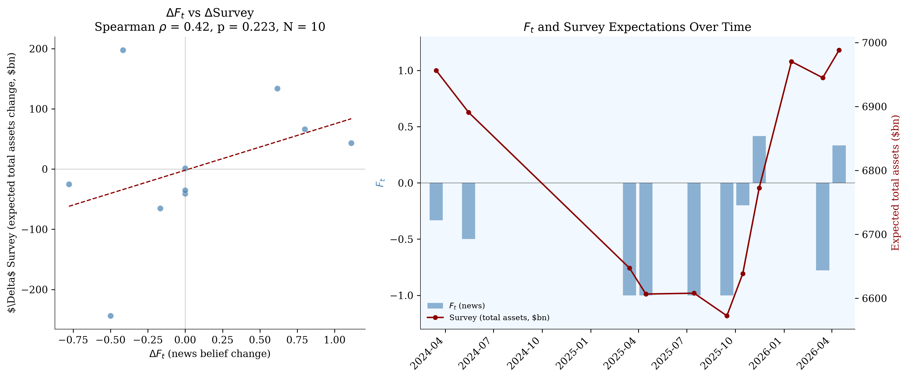

# Fed Balance Sheet Expectations

An LLM-derived news belief index ($F_t$) for Federal Reserve balance-sheet size expectations, compared with NY Fed survey (SPD/SMP/SME) professional-forecaster expectations, following Bybee (2025).

## Data

### News corpus (2011--2026)

| Source | Articles |
|--------|----------|
| NYT Article Search API | 1,022 |
| GDELT DOC 2.0 | 2,491 |
| Google News RSS | 1,236 |
| **Total** | **4,749** |

The source mix shifts across regimes: NYT provides the majority of early coverage (2011--2016), GDELT dominates the middle period (2017--2022), and Google News contributes primarily to recent coverage (2023--2026).

### NY Fed surveys

- **PDF surveys (2011--2023)**: 59 survey rounds extracted from NY Fed PDF releases using Claude Haiku, cached as JSON. This produces a machine-readable panel of balance-sheet expectations (median, 25th, 75th percentile paths at multiple horizons) that is not otherwise available in structured form.
- **Excel surveys (2023--2026)**: 23 survey rounds from NY Fed machine-readable Excel releases.
- **Total**: 82 distinct survey dates, 4,999 variable-horizon observations across SPD, SMP, and SME panels.

### FRED balance-sheet actuals

Weekly Federal Reserve balance-sheet components (WALCL, TREAST, WSHOMCB, WRESBAL) from FRED, 2008--present (964 observations).

## Method

### Classification

Each news headline (with article snippet when available) is classified into four categories using a k=3 ensemble of Claude Haiku calls with majority vote:

- **increase** -- the article signals Fed balance-sheet growth (asset purchases, QE, emergency lending facilities, slower runoff)
- **decrease** -- the article signals balance-sheet contraction (QT, runoff, tapering, normalization)
- **uncertain** -- the article is about balance-sheet direction but the signal is ambiguous
- **not_relevant** -- the article is not about balance-sheet size or purchase/runoff policy

Of 4,749 articles, 749 (15.8%) are classified as relevant (increase, decrease, or uncertain).

### Belief index

The monthly balance statistic is computed over relevant articles only:

$$F_t = \frac{n_{\text{increase}} - n_{\text{decrease}}}{n_{\text{increase}} + n_{\text{decrease}}}$$

$F_t$ ranges from $-1$ (all relevant articles signal decrease) to $+1$ (all signal increase). Months with no increase or decrease articles receive $F_t = \text{null}$.

### Regime segmentation

Six Fed balance-sheet regimes are defined by policy transition dates:

| Regime | Period |
|--------|--------|
| Pre-Taper | Jan 2011 -- May 2013 |
| Taper Tantrum | May 2013 -- Oct 2014 |
| Reinvestment | Oct 2014 -- Sep 2017 |
| QT1 | Sep 2017 -- Jul 2019 |
| QE (COVID) | Jul 2019 -- May 2022 |
| QT2 | Jun 2022 -- present |

## Results

### Regime identification

$F_t$ distinguishes Fed balance-sheet regimes by sign. Mean $F_t$ is positive during expansion periods and negative during contraction periods (months with $n_{\text{relevant}} \geq 3$):

| Regime | Months ($n_{\text{rel}} \geq 3$) | Mean $F_t$ | Total relevant articles |
|--------|----------------------------------|-------------|------------------------|
| Pre-Taper | 3 | +1.00 | 31 |
| Taper Tantrum | 12 | $-0.33$ | 76 |
| Reinvestment | 2 | $-1.00$ | 9 |
| QT1 | 7 | $-0.39$ | 56 |
| QE (COVID) | 17 | +0.06 | 186 |
| QT2 | 21 | $-0.39$ | 355 |

### Figure 1: Belief index with regime shading


$F_t$ over time across six Fed regimes. 749 relevant articles out of 4,749 total (15.8%).

### Contemporaneous correlation with survey expectations

The contemporaneous relationship between $F_t$ and NY Fed survey expectations is measured using a single consistent survey variable: median expected total assets at a ~12-month horizon (`total_assets`), averaged across panels. The sample falls entirely within QT2 (2024--2026).

| Test | Spearman $\rho$ | p-value | N |
|------|-----------------|---------|---|
| Levels (regime-confounded) | +0.69 | 0.018 | 11 |
| First differences (regime-stripped) | +0.42 | 0.223 | 10 |

The level correlation is positive but confounds the shared QE/QT regime structure. First-differencing removes this structure; the differenced correlation is positive but not statistically significant at conventional levels.

### Figure 2: Contemporaneous co-movement



Left: scatter of $\Delta F_t$ vs $\Delta$Survey (first differences, lag 0). Right: $F_t$ and median expected total assets over time.

### Lead-lag analysis

Cross-correlation of first-differenced $F_t$ and survey expectations at lags $\pm6$ months, with Newey-West (HAC) standard errors. Pre-specified test: whether news leads the survey at lag +1.

| Target | Lag | Spearman $\rho$ | p (HAC) | N |
|--------|-----|-----------------|---------|---|
| Total assets | +1 | +0.09 | 0.429 | 34 |
| Treasury holdings | +1 | +0.16 | 0.685 | 41 |
| MBS holdings | +1 | +0.16 | 0.642 | 40 |

The pre-specified lead (lag +1) is positive for all three survey targets but not statistically significant after HAC correction.

## Limitations

- **Small N per consistent survey measure.** The NY Fed surveys balance-sheet questions intermittently and the question format changes across eras. The best-covered single variable (`total_assets`) yields N = 11 merged observations with $F_t$. This limits the power of differenced tests.
- **Level correlations confound the QE/QT regime.** $F_t$ and survey expectations both flip sign by regime. Raw level correlations reflect this shared structure rather than within-regime co-movement.
- **News-source mix shifts across regimes.** NYT dominates the early period (2011--2016), GDELT the middle (2017--2022), and Google News the recent period. Source-specific editorial and topical biases may affect $F_t$ differently across eras.
- **Sparse early coverage.** Many months before 2017 have fewer than 3 relevant articles, producing extreme $F_t$ values ($\pm1$) and limiting usable overlap with the survey.

## Reproduce

### Requirements

```
pip install -r requirements.txt
```

Environment variables (in `.env`):
- `ANTHROPIC_API_KEY`
- `NYT_API_KEY`
- `FRED_API_KEY`

### Pipeline

```bash
# 1. Collect data
python collect_nyfed_survey.py       # NY Fed survey data (Excel)
python extract_pdf_surveys.py        # NY Fed survey data (PDF, cached)
python collect_fred.py               # FRED balance sheet actuals
python collect_gdelt.py              # GDELT news articles
python collect_gnews.py              # Google News articles
python collect_nyt.py                # NYT articles

# 2. Classify
python classify.py validate          # Validation sample (optional)
python classify.py run               # Full classification (k=3 ensemble)

# 3. Aggregate
python aggregate.py                  # Monthly F_t

# 4. Analysis
python leadlag_analysis.py           # Lead-lag cross-correlation
python contemporaneous_analysis.py   # Contemporaneous co-movement tests

# 5. Figures
python visualize.py                  # Fig 1 (beliefs) and Fig 2 (correlation)
```

## References

- Bybee, L. (2025). *The Ghost in the Machine: Generating Beliefs with Large Language Models*. Working Paper.
